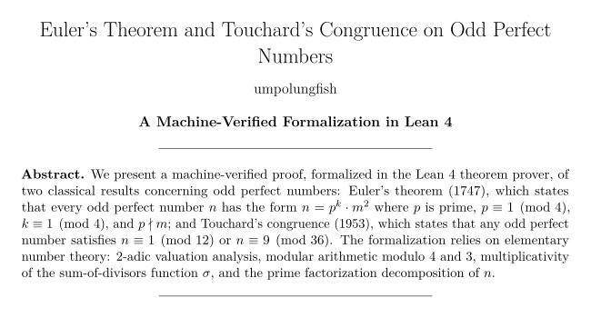

# Odd Perfect Numbers — Euler's Theorem and Touchard's Congruence

Machine-verified proofs in Lean 4 / Mathlib4.

## What this proves

**Euler's theorem (1747)** — `euler_opn_form`

Every odd perfect number $n$ has the form $n = p^k \cdot m^2$ where:
- $p$ is prime
- $p \equiv k \equiv 1 \pmod{4}$
- $p \nmid m$

**Touchard's congruence (1953)** — `touchard_congruence`

Any odd perfect number $n$ satisfies $n \equiv 1 \pmod{12}$ or $n \equiv 9 \pmod{36}$.

The Touchard result is unconditional: it calls `euler_opn_form` internally rather than assuming Euler form.

## Supporting lemmas

| Name | Statement |
|------|-----------|
| `sigma_mul_of_coprime` | $\sigma(ab) = \sigma(a)\cdot\sigma(b)$ for coprime $a$, $b$ |
| `opn_product_constraint` | $\sigma(p^k)\cdot\sigma(m^2) = 2\cdot p^k m^2$ (Euler product equation) |
| `sigma_prime_pow_ratio` | $\sigma(p^k)\cdot(p-1) + 1 = p^{k+1}$ (geometric series identity) |
| `v2_sigma_prime_power` | $v_2(\sigma(p^k)) = 1$ when $p \equiv k \equiv 1 \pmod{4}$ |
| `v2_sigma_square_factor` | $v_2(\sigma(q^{2e})) = 0$ for any odd prime $q$ |

## Proof sketch for `euler_opn_form`

1. $\sigma(n) = 2n$ with $n$ odd forces $v_2(\sigma(n)) = 1$.
2. $\sigma$ is multiplicative, so $\sum_{p \mid n} v_2(\sigma(p^{a_p})) = 1$.
3. The sum of nonneg integers equals 1 → exactly one prime $p$ contributes $v_2 = 1$.
4. Mod-4 case analysis on $p$ and $a_p$ forces $p \equiv a_p \equiv 1 \pmod{4}$.
5. All other prime factors have even exponent → they form $m^2$.
6. $p \nmid m$ follows since $p$ does not appear in the product defining $m$.

## Building

Requires [Lean 4](https://leanprover.github.io/) and [Mathlib4](https://github.com/leanprover-community/mathlib4).

```bash
# Clone this repo and a Mathlib4 checkout side-by-side, then:
lake build OddPerfectNumbers
```

The `lakefile.lean` references Mathlib4 via a local relative path `../mathlib4_PROOFS/mathlib4`.
To point at the published Mathlib instead, replace that block with a `git` require (see the
comment in `lakefile.lean`) and run `lake update`.

Toolchain: `leanprover/lean4:v4.30.0-rc2`

## References

- Euler, L. (1747). *De numeris perfectis*. Opera Omnia I.2, 86–162.
- Touchard, J. (1953). *On prime numbers and perfect numbers*. Scripta Math. 19, 35–39.
- Ochem, P. and Rao, M. (2012). *Odd perfect numbers are greater than $10^{1500}$*.
  Math. Comp. 81, 1869–1877.
